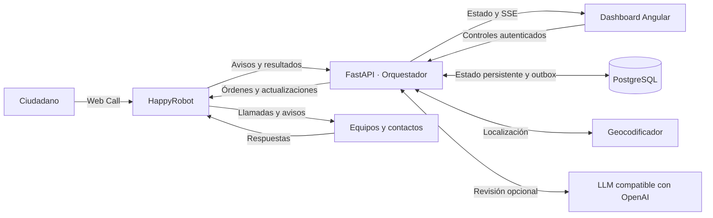

# Arquitectura y guía técnica

[Volver a la presentación del proyecto](../README.md)

Este documento reúne la arquitectura, los contratos, las decisiones de implementación, el arranque local y la verificación. La presentación y el guion de demo están en el [README principal](../README.md).

- [Arquitectura](#arquitectura) y [organización del código](#dónde-está-cada-pieza).
- [Recepción ciudadana](#recepción-ciudadana-y-misiones-por-servicio), [geocodificación](#localización-y-geocodificación) y [seguimiento](#movimiento-y-puesto-de-mando).
- [Persistencia](#propiedad-de-datos-y-persistencia), [contrato de observaciones](#contrato-que-escriben-los-agentes) y [sincronización](#sincronización-y-datos-atrasados).
- [Decisiones y reservas](#decisiones-y-reservas), [outbox](#outbox-y-resultados-happyrobot) y [controles](#api-del-dashboard-e-intervención).
- [Demo local](#demo-local-sin-llamadas-reales), [pruebas](#verificación) y [límites operativos](#límites-operativos-y-precauciones).

## Arquitectura



**HappyRobot es la capa de comunicación; el backend es la autoridad sobre el estado operativo.** Las llamadas y los avisos de Telegram salen a través de workflows, no de una implementación telefónica o un bot de Telegram en el backend.

| Capa                 | Tecnologías y responsabilidad                                                                             |
| -------------------- | --------------------------------------------------------------------------------------------------------- |
| Voz y comunicaciones | HappyRobot: recepción Web Call, llamadas a equipos, ciudadanos y autoridades, avisos por `send_telegram`. |
| Orquestación         | Python 3.12+, FastAPI y Pydantic: contratos, observaciones, planificación, asignación y controles.        |
| Persistencia         | PostgreSQL y psycopg; backend en memoria para demos efímeras.                                             |
| Interfaz             | Angular 22, TypeScript, signals, RxJS, Leaflet y Tailwind CSS.                                            |
| Geografía            | Geocodificación compatible con Nominatim y rutas de mapa compatibles con OSRM.                            |
| Calidad              | pytest, Ruff y mypy para la API; Vitest para el dashboard; CI del backend en GitHub Actions.              |

### Dónde está cada pieza

```text
apps/
  api/
    app/agent/          Planificación, asignación, ejecución y orquestación
    app/domain/         Modelo operativo, avisos, autonomía y movimiento
    app/integrations/   HappyRobot y geocodificación
    app/store/          Memoria, PostgreSQL y migración
    tests/              Pruebas de dominio, API, integración y concurrencia
  simulator/            Eventos de crisis y respuestas simuladas
dashboard/              Puesto de mando Angular
docs/                   Documentación técnica y contratos
```

Para explorar el núcleo: [avisos y servicios](../apps/api/app/domain/intake.py), [reparto de recursos](../apps/api/app/agent/allocation.py), [orquestador](../apps/api/app/agent/orchestrator.py), [ejecución y outbox](../apps/api/app/agent/executor.py) y [persistencia SQL](../apps/api/app/store/postgres.py).

## Recepción ciudadana y misiones por servicio

El ciudadano habla con un agente de voz mediante Web Call. HappyRobot envía el parte a `POST /api/v1/webhooks/happyrobot/inbound`, autenticado con `X-Webhook-Secret`, con `run_id`, `timestamp` ISO con zona horaria y los datos estructurados de la emergencia. Esta entrada no requiere una acción saliente previa.

Cada run tiene un aviso actualizable en `incoming_calls`; los informes atrasados se ignoran. El snapshot persistente y SSE incluyen estos avisos, también cuando aún no tienen coordenadas.

`service_requirements()` compone las necesidades de bomberos, sanitarios y policía según tipo, gravedad, víctimas, atrapados y riesgos. Hay una misión idempotente por servicio y aviso, con su propio motivo; los reintentos del mismo parte no multiplican intervenciones. `Orchestrator.reconcile_intake()` ejecuta esa propuesta y revisa las misiones que un aviso corregido invalida. La falta de medios de un servicio no bloquea por sí sola a los demás.

Las misiones de entrada usan prioridades de 0 a 100 según gravedad; las propuestas del escenario tienen reglas que consideran, entre otros factores, heridos, población expuesta y ETA del frente. Cada misión conserva `priority_reason`.

La configuración del agente de voz y sus workflows vive en HappyRobot, fuera del código local. El cliente simulado no mantiene una conversación real ni genera aceptación automáticamente: los resultados llegan mediante el simulador o callbacks explícitos.

## Localización y geocodificación

Si faltan coordenadas utilizables, `locate_pending_reports()` busca la dirección en el bucle del orquestador. No se hace dentro del webhook que atiende al workflow ciudadano, para evitar que la recepción espere al proveedor externo.

- Solo se selecciona automáticamente un candidato único y suficientemente concreto, identificado como ubicación aproximada.
- Los resultados ambiguos o centros genéricos de población no se seleccionan solos.
- Sin ubicación utilizable, la propuesta permanece bloqueada mediante `blocked_reason`: no se cancela ni se envía a un punto inventado.
- Los resultados y errores se conservan en `incoming_calls[].resolution`; una respuesta tardía no sobrescribe una corrección posterior.
- La cola se comparte en el runtime, con caché acotada, búsquedas limitadas a España y al menos 1,1 segundos entre inicios de petición. No hay autocomplete ni polling del geocodificador.
- No se deducen coordenadas a partir del teléfono. Los puntos declarados requieren ambas coordenadas válidas.

`POST /api/v1/control/incoming-calls/{run_id}/location` permite corregir el destino incluso con una misión en curso: invalida las órdenes afectadas y vuelve a proponer contra el punto corregido. No declara disponible una unidad que ya recibió la comunicación. Un reintento de geocodificación no equivale a una corrección explícita y sigue bloqueado mientras hay misión en curso.

> [!CAUTION]
> Cuando está habilitada, la configuración predeterminada envía las direcciones —incluidas las privadas— al Nominatim público. Fuera de la demo, configura `GEOCODING_ENDPOINT` con una instancia propia o un proveedor adecuado. `GEOCODING_ENABLED=false` desactiva esta búsqueda.

## Movimiento y puesto de mando

`app/domain/movement.py` y `Orchestrator.advance_missions()` calculan el avance de las unidades `en_route`: el desplazamiento comienza tras la aceptación, no al enviar la orden. Se basa en `travel_from`, `travel_started_at`, `travel_minutes` y `travel_progress`, y se identifica con `position_estimated`.

Un parte `resource_status` con ubicación prevalece sobre la estimación y reinicia el trayecto desde ese punto. La llegada estimada pone la unidad `on_scene`, pero no cierra la misión. Avances menores del 1 % no se publican para evitar versionar el estado en cada ciclo.

El dashboard usa componentes standalone, signals y rutas cargadas de forma diferida. Inicio, Incidencias, Recursos y el registro de operaciones comparten la fuente API/SSE de `Operations`. Conserva el último snapshot ante fallos de conexión y usa refresco HTTP cada cinco segundos mientras SSE no está disponible, sin sustituir los datos por mocks.

El mapa es el único que descarga rutas. `DemoRouteSimulation` interpola sobre la geometría ya descargada usando salida y duración del backend, sin decidir el estado operativo por la animación. Las misiones de avisos ciudadanos no solicitan rutas al proveedor público: muestran la posición estimada del backend. No se representa GPS ni tráfico en directo.

El registro muestra eventos, preguntas, respuestas, notas y comunicaciones, con errores, transcripciones y run IDs cuando están disponibles, sin volcar requests completos ni secretos.

## Propiedad de datos y persistencia

Los agentes no escriben en la base: aportan **solo observaciones** por HTTP y el backend las
traduce a `crisis_observations`. El backend es el dueño del estado consolidado, las
asignaciones, decisiones, recibos y órdenes. Se conserva el informe original y se emite una
observación nueva para corregirlo, sin editar el anterior. La credencial de PostgreSQL es
exclusiva del backend; no se reparte a los agentes ni al dashboard.

`crisis_world` guarda un snapshot versionado por incidente. `WorldState` es su proyección
local y puede recuperarse al reiniciar. El dashboard recibe un extracto reciente, mientras
que la persistencia incluye todas las tareas y órdenes, también pendientes y ambiguas.
Los eventos y decisiones en memoria se limitan a 2.000 y 500; `crisis_journal` conserva el resto.

La versión v1 usa una única sentencia SQL con CTEs para guardar conjuntamente snapshot,
recibos, asignaciones, comandos y journal. La actualización exige `version = expected_version`.
Un conflicto revierte la propuesta local: no se publica por SSE ni se envía a HappyRobot.
Al decidir o reclamar un envío también se comprueba, en la misma sentencia, que no haya
observaciones pendientes. Esto evita enviar una orden con datos que llegaron entre el último
poll y el guardado. Dos escritores del mismo incidente no pueden confirmar la misma versión.

El comportamiento SQL está probado sobre PostgreSQL 17, con un schema temporal por test.
No se asumen CDC, triggers ni `LISTEN/NOTIFY`. Cada consulta abre su conexión con
`statement_timeout = 15s`. `HAPPYROBOT_ENVIRONMENT` afecta a los workflows, no a la base.
Los IDs de incidente aíslan escenarios dentro de la misma base.

## Contrato que escriben los agentes

Fila en `crisis_observations`:

| Columna          | Valor                                                 |
| ---------------- | ----------------------------------------------------- |
| `observation_id` | ID estable y global; mismo ID en todos los reintentos |
| `incident_id`    | incidente objetivo                                    |
| `body`           | objeto JSON completo siguiente                        |
| `received_at`    | dejar el valor por defecto del servidor               |

```json
{
  "observation_id": "obs-llamada-123-resultado-1",
  "schema_version": 1,
  "incident_id": "incendio-gredos-demo",
  "kind": "call_outcome",
  "observed_at": "2026-09-19T10:00:00Z",
  "source": "happyrobot",
  "source_run_id": "RUN_ID",
  "command_id": "ACT_ID",
  "title": "La ambulancia acepta la misión",
  "severity": "high",
  "payload": {
    "outcome": "accepted",
    "eta_minutes": 12,
    "summary": "Salimos ahora"
  }
}
```

Los IDs del envelope y de la fila deben coincidir. `observed_at` lleva zona horaria y representa
el momento de observación, no el momento de un reintento. Los agentes deben enviarlo siempre.
`entity_id` es metadato opcional; la referencia operativa va en el payload indicado aquí:

| `kind`                                   | Payload                                                                                                              |
| ---------------------------------------- | -------------------------------------------------------------------------------------------------------------------- |
| `fire_spread`                            | `front_id`; opcionales `heading_deg`, `speed_kmh`, `intensity`, `contained_pct`, `threatens: {zone_id: eta_minutes}` |
| `wind_change`                            | `wind_from_deg`, `wind_kmh`                                                                                          |
| `road_blocked`, `road_open`              | `road_id`, opcional `reason`                                                                                         |
| `injured_reported`, `civilians_reported` | `count`, con `zone_id` en envelope o payload                                                                         |
| `resource_status`                        | `resource_id`, `status`, opcionales `eta_minutes`, `task_id`                                                         |
| `call_outcome`, `message_outcome`        | resultado correlacionado, descrito más abajo                                                                         |
| `integration_down`, `integration_up`     | `name: happyrobot` o `llm`                                                                                           |
| `note`                                   | texto en `title`, payload opcional                                                                                   |

Los contadores son valores absolutos. Los informes `resource_status` guardan `reported_status`
y `reported_at` sin sobrescribir una reserva activa. `reserved` pertenece al backend.
Para confirmar disponibilidad tras una misión hay que incluir su `task_id`; un informe de
otra misión o anterior a la reserva no libera la unidad. Marcar una tarea `done` tampoco
demuestra por sí mismo que el vehículo esté disponible.

La API ofrece `POST /api/v1/observations` con el mismo envelope y `X-API-Key`.
`POST /events`, `/events/batch`, el simulador y el webhook se convierten al mismo contrato.
Una respuesta `202` confirma recepción; el resultado de aplicación se consulta en
`GET /api/v1/receipts`, con `X-API-Key`. Un ID repetido con otro contenido se rechaza.

## Sincronización y datos atrasados

Cada `STORE_POLL_SECONDS` se consultan observaciones sin recibo, ordenadas por
`received_at, observation_id`, con límite `STORE_BATCH_SIZE`. Se guardan por lotes y la consulta
siguiente excluye los recibos ya confirmados. No se usa un cursor temporal que pueda saltarse
inserciones concurrentes con fechas antiguas. Tras 20 lotes se continúa en la siguiente vuelta,
sin despachar mientras queden datos pendientes. Un error o timeout de la base detiene la
operación, marca `integrations.storage` como caído y bloquea el despacho.

Cada observación se valida sobre una copia. Incidentes/referencias desconocidos, tipos o rangos
inválidos y fechas futuras generan un recibo `invalid`; la copia se descarta. Se comparan relojes
por frente, carretera, recurso o tipo de contador; los datos atrasados generan `ignored`.
Las notas se conservan aunque lleguen tarde. Solo después del guardado atómico se publica el
nuevo world state.

Los hechos derivados de un callback (heridos, carretera, recurso) tienen IDs deterministas y
se validan en la misma transacción que su observación raíz. Quedan en snapshot/journal,
con un único recibo raíz; no necesitan otra inserción en la bandeja de entrada.
Un callback con heridos pero sin zona identificable conserva el aviso con
`location_unconfirmed=true`; un operador debe aportar la ubicación antes de asignar asistencia.

## Decisiones y reservas

1. Sincronizar y leer una versión coherente del incidente.
2. Reevaluar tareas vigentes: destino, contención, amenaza y disponibilidad del recurso.
3. Crear propuestas de asistencia, extinción, avisos, evacuación, albergues y carreteras.
4. Opcionalmente revisar prioridades, resumen, descartes y recurso sugerido con un LLM.
5. Revalidar observaciones nuevas y comprobar en código tipos de unidad, contacto, reserva,
   disponibilidad y acceso. El LLM no envía órdenes ni escribe asignaciones.
6. Ordenar por prioridad y seleccionar medios considerando ETA, distancia aproximada,
   capacidad, fiabilidad del contacto y cobertura restante. Ambulancias/autobuses sin capacidad
   declarada no se asignan. Se asigna un recurso por tarea; la cobertura es una preferencia,
   no un cálculo de flota óptima.
7. Con autonomía activa, asignar por prioridad, también para avisos `vital` y evacuaciones.
   Si faltan medios, se puede reasignar una unidad desde una misión de prioridad inferior.
   Solo los empates entre las prioridades más altas que compiten por medios insuficientes
   requieren elección del operador. Las órdenes automáticas se retienen `hold_seconds`
   (10 segundos por defecto) para permitir su anulación. Con `autonomous=false`, las
   decisiones requieren confirmación humana contra el estado actual.
8. Confirmar decisión, reserva y orden `pending` en la base. Rechazar una evacuación impide que
   el siguiente tick vuelva a crearla automáticamente; el operador puede crear una tarea nueva.
9. Reclamar y revalidar cada envío, guardar `sending` e invocar HappyRobot.
10. Registrar resultado y volver a percibir. Viento y cortes generan Signals para las
    conversaciones suscritas a `crisis.update`.

La revisión LLM es opcional: puede filtrar ruido, ajustar prioridades, explicar descartes y
sugerir un recurso. Si no hay clave o la revisión falla, continúa el planificador heurístico.
La sugerencia no envía órdenes ni escribe asignaciones directamente; el backend comprueba
las restricciones y revalida el plan si llega nueva información.

El modelo de carreteras comprueba accesos abiertos al destino; no calcula rutas completas.
Una carretera que cambia provoca replanificación/señales y bloquea órdenes terrestres
pendientes sin acceso. Una unidad movilizada puede reasignarse automáticamente por mayor
prioridad, pero la redirección prepara una nueva comunicación y necesita una aceptación nueva.
No se declara libre una unidad por cancelar su llamada.

### Conflictos de recursos y controles humanos

`allocation.py` compara las necesidades simultáneas antes de reservar y comparte
`allocate_resource()` entre las decisiones humanas y automáticas. Los empates generan
preguntas persistentes con `allocationTaskIds`, `allocationResourceId` y `expiresAt=null`:
no caducan ni se resuelven por silencio. Las prioridades inferiores esperan sin bloquear
a las superiores, y la llegada de refuerzos provoca un nuevo cálculo. Si no existe una unidad
compatible reasignable, el conflicto lo indica sin inventarla.

Las respuestas revalidan misiones, prioridades, estado y asignación de la unidad. Una
reasignación cancela la orden anterior y prepara una llamada nueva, sin fingir aceptación.
`reassigned_from_task_id` impide liberar una unidad ya movilizada por el mero rechazo de la
redirección. Los callbacks de acciones retiradas de `task.action_ids` no alteran la misión
replanificada.

La retención se comprueba después de revalidar la tarea: una orden retenida cuyo aviso cambió
se cancela en lugar de esperar para salir hacia un destino antiguo. Desactivar la autonomía
revalida las órdenes aún no enviadas, libera sus reservas y devuelve las decisiones a
confirmación, sin alterar misiones que ya salieron. La parada de emergencia bloquea envíos
nuevos, incluidos los retenidos; no cancela runs ya enviados ni libera unidades movilizadas.

Las preguntas y notas viven en el snapshot. Sus respuestas son persistentes e idempotentes
por pregunta, y sus efectos se revalidan. En las preguntas que sí tienen vencimiento, el servidor
lo procesa sin depender del navegador; una respuesta por vencimiento no puede aprobar,
cancelar ni movilizar recursos. Los conflictos de reparto no tienen ese vencimiento.

Los campos `approval_required_for` y `approval_required_severities` se conservan para leer
snapshots anteriores, pero ya no activan aprobación por gravedad. La frontera actual vive en
[autonomía](../apps/api/app/domain/autonomy.py) y [asignación](../apps/api/app/agent/allocation.py).

## Outbox y resultados HappyRobot

```text
pending → sending → dispatched → completed / failed
                  ↘ unknown
pending → skipped (tarea invalidada, rechazo o caducidad)
```

El estado de una acción describe la **comunicación**. Una llamada aceptada puede estar
`completed` mientras la tarea sigue `accepted` y la unidad `en_route`.
Un aviso de Telegram permanece `dispatched` hasta la observación `message_outcome`:
no se considera entregado solo por haber disparado el workflow. Su entrega tampoco actualiza
la fiabilidad del contacto, que se pondera con resultados de llamadas.

El payload del workflow incluye `command_id` (= `action_id`), `task_id`, `resource_ids`,
`incident_id`, `world_state_version`, contacto/teléfono, instrucciones, clima, carreteras,
`observations_table` y `callback_url`. Workflows: `call_responder`, `call_civilian`,
`notify_authority`, `send_telegram`. Los avisos de texto usan `send_telegram`: el backend
dispara el workflow y es el workflow quien hace el POST a la API de Telegram. El backend no
habla con Telegram ni con ningún puente intermedio. El payload de un aviso incluye
`command_id`, `action_id`, `channel`, `message`, `contact_id`, `contact_name`, `task_id`,
`incident_id` y `callback_url`; `task_id` puede ser null. El chat de destino lo resuelve
HappyRobot, porque un teléfono no es un chat de Telegram.
Una orden con un workflow que no corresponde a su `kind` falla en vez de cambiar de canal.

El agente reporta el resultado con `POST /api/v1/webhooks/happyrobot` y `X-Webhook-Secret`:

```json
{
  "observation_id": "obs-llamada-123-resultado-1",
  "command_id": "ACT_ID",
  "run_id": "RUN_ID",
  "observed_at": "2026-09-19T10:00:00Z",
  "outcome": "accepted",
  "eta_minutes": 12,
  "summary": "Salimos ahora"
}
```

También admite `task_id` si solo hay una comunicación correlacionable y los campos
`injured_count`, `civilians_count`, `road_blocked`, `evacuation_confirmed`, `resource_status`,
`shelter_capacity`, `session_id`, `transcript`, `extra`.
`outcome`: `accepted`, `rejected`, `no_answer`, `voicemail`, `busy`, `failed`, `info`.
La correlación se comprueba; no basta con citar una tarea distinta. Para información posterior
usa una observación nueva con `outcome=info` y fecha nueva.

Sin ID explícito el webhook calcula uno estable del cuerpo. Sin fecha usa la de creación
de la orden para conservar compatibilidad y no dejar que un callback tardío libere una misión
posterior. Los agentes nuevos deben enviar ID y fecha explícitos. Si se combinan el webhook y
`POST /api/v1/observations` para la misma observación, hay que normalizar exactamente el mismo
envelope; lo recomendado es elegir una vía por workflow.

Un fallo de conexión previo al envío o un `429` tiene como máximo tres intentos con espera.
Timeouts tras enviar, respuestas malformadas y errores POST `5xx` quedan `unknown` y no se
reenvían automáticamente. Los comandos `sending` encontrados al arrancar pasan a `unknown`.
Las órdenes pendientes se recuperan y se envían al reanudar el agente. Con
`AGENT_AUTOSTART=false` puede usarse un tick manual o reactivar explícitamente el bucle.
Las comunicaciones caducan en diez minutos antes de su primer envío (señales en dos),
salvo las retenidas por un conflicto de reparto, que no caducan mientras se espera la decisión.

No se promete entrega «exactamente una vez» a un servicio externo: se conservan los estados
inciertos y se ofrece reconciliación en lugar de duplicar una comunicación a ciegas.

`POST /control/actions/{id}/reconcile` consulta un `run_id` conocido sin reenviar.
Un run terminado sin resultado operativo conserva la incertidumbre y la reserva.
Si falta el run ID, hay que localizar `command_id` en HappyRobot y aportar una observación
correlacionada; no existe un botón de reenvío ciego. Un reinicio concurrente puede marcar
`unknown` un envío de otro proceso todavía activo; esto es conservador y evita duplicarlo.

## API del dashboard e intervención

Todos los endpoints cuelgan de `/api/v1`:

- `/state`, `/tasks`, `/resources`, `/contacts`, `/actions`, `/decisions`, `/timeline`.
- `/stream`: snapshot inicial y snapshots confirmados; `id` SSE y `version` coinciden.
  Al reconectar se recibe otro snapshot, sin replay de deltas. Ante un hueco o `resync`,
  descargar `/state`. No aplicar snapshots más antiguos que el que ya se muestra.
- `/control/pause` (parada de emergencia: frena también las órdenes retenidas, sin cancelar
  lo ya enviado), `/control/resume`, `/control/resume-simulated`, `/control/tick`,
  `/control/agent` (autonomía y ventanas). `resume-simulated` rechaza el modo live.
- `/control/questions`, `/control/questions/{id}/answer`: preguntas persistentes y respuestas
  autenticadas, idempotentes y revalidadas.
- `/control/incoming-calls/{run_id}/location`: corrección explícita de la ubicación del aviso.
- `/control/tasks`, `/control/tasks/{id}/approve`, `/control/tasks/{id}/priority`,
  `/control/tasks/{id}/status` (con `cancelled` anula la orden no enviada y libera su reserva;
  si ya salió la comunicación, no declara disponible la unidad).
- `/control/call`, `/control/telegram`, `/control/note`,
  `/control/actions/{id}/reconcile` (sirve también para avisos, que tienen `run_id`).
- `/control/incident`: inicialización explícita, solo si no hay incidente activo.
- `/history/runs`, `/history/runs/{id}/journal`, `/history/lessons`.

Escrituras y control requieren `X-API-Key`; el webhook usa su propio secret.
El esquema OpenAPI de `/docs` describe los campos completos. El dashboard no debe mutar
las tablas del backend. `MemoryStore` conserva estos contratos para una demo sin credenciales;
no persiste tras cerrar el proceso. Configuración y comandos: [API](../apps/api/README.md).

## Demo local sin llamadas reales

### Requisitos

- **Python 3.12 o superior** y **uv**.
- **Node.js compatible con Angular 22**: `^22.22.3 || ^24.15.0 || >=26.0.0`. En el proyecto se ha verificado Node `24.20.0`.
- **npm 11.19.0**, versión declarada por el dashboard.
- Docker solo si quieres usar PostgreSQL; el arranque siguiente usa memoria.

Los comandos parten de la raíz del repositorio, en terminales separadas. No hace falta copiar ni sobrescribir ningún `.env`.

> [!IMPORTANT]
> Este arranque fuerza las comunicaciones simuladas, desactiva la revisión LLM y la geocodificación remotas y deja el bucle de planificación sin autoarranque hasta que lo actives. Las claves de ejemplo son **solo para desarrollo local**. El mapa del navegador puede seguir consultando teselas y rutas públicas: no es una demo completamente offline.

### 1. Arrancar la API

```bash
cd apps/api
uv sync --frozen

export STORAGE_BACKEND=memory HAPPYROBOT_MODE=simulated
export AGENT_AUTOSTART=false AGENT_AUTONOMOUS=true SEED_DEMO=true
export OPENAI_API_KEY= GEOCODING_ENABLED=false SEED_PHONES=
export API_KEY=dev-secret HAPPYROBOT_WEBHOOK_SECRET=demo-webhook-only
export PUBLIC_BASE_URL=http://127.0.0.1:8000

uv run uvicorn app.main:app --reload --host 127.0.0.1 --port 8000
```

- OpenAPI: [http://127.0.0.1:8000/docs](http://127.0.0.1:8000/docs).
- Salud y modo efectivo: [http://127.0.0.1:8000/healthz](http://127.0.0.1:8000/healthz).
- Con `memory`, reiniciar o recargar el proceso pierde el estado de esa demo.

### 2. Abrir el puesto de mando

```bash
cd dashboard
npm ci
API_KEY=dev-secret API_PROXY_TARGET=http://127.0.0.1:8000 npm start -- --host 127.0.0.1
```

Abre [http://localhost:4200](http://localhost:4200). El proxy de desarrollo inyecta la clave de operador sin incluirla en el bundle del navegador. Aquí se fija explícitamente el destino `8000`, porque el proxy del proyecto usa `8001` por defecto.

### 3. Activar el agente e introducir eventos

Primero comprueba que `/healthz` indica `happyrobot_mode: simulated`. Después activa el bucle con el endpoint que **rechaza el modo live**:

```bash
curl -X POST http://127.0.0.1:8000/api/v1/control/resume-simulated \
  -H 'X-API-Key: dev-secret'
```

En esa misma terminal, desde la raíz del repositorio:

```bash
cd apps/simulator
uv sync --frozen
API_KEY=dev-secret HAPPYROBOT_WEBHOOK_SECRET=demo-webhook-only \
  uv run python simulator.py --api-url http://127.0.0.1:8000/api/v1 \
  --seed 7 --no-reset --no-approve
```

`--no-reset` conserva el escenario que ya está abierto y `--no-approve` evita que un operador simulado conteste aprobaciones. Verás eventos, decisiones y respuestas de comunicaciones sin realizar llamadas reales. Detener el simulador no pausa el agente; usa la parada del dashboard cuando quieras frenar nuevos envíos.

El simulador introduce eventos durante las fases de ignición, escalada, complicaciones y resolución, con una semilla aleatoria configurable. Genera cambios de viento, cortes de carretera, heridos, incidencias de recursos y ruido, y simula respuestas a llamadas, incluidos rechazos y falta de respuesta.

> [!TIP]
> Deja visible el registro junto al mapa para observar por qué se asigna una unidad y qué ocurre si no responde. Puedes ajustar la cadencia con `--min-delay` y `--max-delay`. El [guion de presentación](../README.md#qué-enseñar-en-una-demo) propone situaciones que merece la pena enseñar.

La demo local cubre la coordinación simulada. **La recepción por voz requiere configurar el workflow Web Call de HappyRobot y su callback autenticado**; tener un `run_id` simulado no equivale a haber mantenido una conversación real.

### Conservar el estado con PostgreSQL

El [Compose de desarrollo](../apps/api/compose.yaml) proporciona PostgreSQL en `127.0.0.1:55433` con volumen persistente. Sigue la [guía de la API](../apps/api/README.md#postgresql-persistencia-duradera) para configurar `STORAGE_BACKEND=postgres` y `DATABASE_URL`.

Sobre una base vacía, el arranque crea el esquema v1. Si encuentra un esquema parcial o incompatible, se detiene sin modificarlo. La persistencia no necesita credenciales de HappyRobot.

La configuración se resuelve en este orden: **entorno del proceso → `.env.local` → `.env` → valores por defecto**. Los cambios de entorno requieren reiniciar; la política de autonomía de un incidente ya guardado se conserva en su snapshot.

## Verificación

### Backend

Desde `apps/api`, con sus dependencias instaladas:

```bash
export HAPPYROBOT_MODE=simulated AGENT_AUTOSTART=false OPENAI_API_KEY=
uv run ruff check .
uv run ruff format --check .
uv run mypy app
uv run pytest -q
```

La API cuenta con más de cien pruebas. Cubren, entre otros casos, avisos duplicados y atrasados, prioridades en competencia, reasignación de unidades movilizadas, respuestas obsoletas, parada de emergencia, ubicaciones ambiguas, timeouts de envío y recuperación tras reinicios. Las pruebas aíslan la configuración local y bloquean el transporte HTTP externo.

Para incluir las pruebas SQL, configura `TEST_POSTGRES_DSN` contra una base **de desarrollo** siguiendo la [guía de pruebas](../apps/api/README.md#pruebas-y-calidad). Cada prueba usa su propio esquema temporal. Sin esa variable, los casos que requieren PostgreSQL se omiten; la CI de la API sí dispone de ese servicio.

### Dashboard

Desde `dashboard`, con Node y npm compatibles:

```bash
npm run build
npm test -- --watch=false
```

La suite de Vitest incluye estado y transporte, geocodificación, rutas, mapa y vistas operativas. Consulta las [notas del dashboard](../dashboard/AGENTS.md) para los requisitos de almacenamiento web en Node y las incidencias de pruebas conocidas.

## Límites operativos y precauciones

> [!WARNING]
> **`HAPPYROBOT_MODE=live` puede generar llamadas y mensajes reales.** Las llamadas usan los teléfonos configurados para los contactos; no basta con que el proyecto se llame «demo». Revisa modo, destinatarios, workflows y entorno publicado antes de activarlo. Pausar bloquea envíos nuevos, pero no cancela comunicaciones ya enviadas ni libera unidades movilizadas.

> [!CAUTION]
> **Los servicios geográficos públicos no son un entorno privado.** La configuración predeterminada de geocodificación puede enviar direcciones privadas al Nominatim público. Para trabajar con datos sensibles o fuera de la demo, configura una instancia propia o un proveedor adecuado. Revisa también los proveedores de mapas y rutas, y no publiques secretos, teléfonos reales ni URLs privadas de callbacks.

- **Prototipo, no infraestructura de emergencias:** no sustituye protocolos oficiales, validación operativa ni sistemas de despacho certificados. La persistencia no convierte la heurística demo en un motor geográfico ni valida protocolos de emergencias.
- **Geografía aproximada:** ni el movimiento representa GPS, ni las rutas reflejan tráfico en directo, ni la heurística garantiza una asignación óptima de toda la flota.
- **Despliegue acotado:** está previsto un único proceso activo por incidente. CAS protege escrituras concurrentes, pero no hay elección de líder ni leases distribuidos.
- **Tamaño del estado:** cada guardado reescribe el snapshot JSON completo. Un incidente largo puede agotar el `statement_timeout` y exige archivar o evolucionar la proyección. El histórico devuelve hasta 250 entradas (50 incidentes), y los recibos hasta 250.
- **Autenticación de desarrollo:** el proxy local no sustituye una sesión de usuario y una política de permisos para un despliegue público.
- **Servicios externos configurables:** la voz real, Telegram y la revisión LLM requieren sus respectivas configuraciones. El workflow de Telegram documentado usa un chat de destino único; no implica un directorio completo de chats por contacto.

## Referencias

- [API: arranque, PostgreSQL, migración, comunicaciones y pruebas](../apps/api/README.md).
- [Simulador: fases, parámetros y respuestas](../apps/simulator/README.md).
- [Dashboard: convenciones, entorno y verificación](../dashboard/AGENTS.md).

Algunas secciones históricas de la guía de la API todavía describen aprobación por gravedad. La política actual es la documentada aquí: asignación autónoma por prioridad, con elección humana en empates por escasez o en modo manual.

[Volver al README](../README.md).
